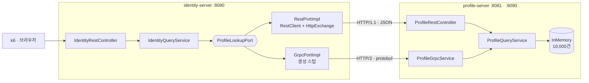

# grpc-vs-rest-lab

MSA 서비스 간 통신에서 gRPC 가 REST/JSON 대비 실제로 얼마나 빠른지, 그리고 브라우저에서는 어떻게 보이는지 같은 조건에서 측정하는 토이 프로젝트.

Spring Boot 3.5 · Java 17 · gRPC 1.73 · grpc-gateway · Envoy

## 목표

MSA 구조에서 gRPC 는 사실상 표준처럼 채택된다. 그런데 채택 근거로 인용되는 수치는 출처마다 크게 다르다. "7~10배 빠르다"는 문장과 "작은 페이로드에서는 차이가 거의 없다"는 문장이 같이 돌아다닌다.

세 가지를 직접 확인한다.

1. **얼마나 빠른가.** 같은 도메인 로직에 전송 방식만 바꿔 측정한다. 페이로드 크기와 동시성을 축으로 분리해, 차이가 커지는 구간과 사라지는 구간을 찾는다.
2. **무엇이 빠르게 만드는가.** 프로토버프 직렬화인가, HTTP/2 멀티플렉싱인가, 커넥션 재사용인가. 이걸 구분하지 않으면 "gRPC 를 넣었는데 안 빨라졌다"의 원인을 짚을 수 없다.
3. **브라우저에서는 어떻게 보이는가.** 개발자도구 Network 탭에서 프로토버프가 실제로 어떤 모습인지, grpc-gateway 를 끼우면 무엇이 달라지는지 눈으로 확인한다.

## 리서치

측정 전에 확인한 사실들. 상세는 [docs/research.md](docs/research.md).

### gRPC 는 오래된 기술이고, 늦은 쪽은 Spring 이었다

gRPC 를 도입할 때 "Spring 공식 지원이 Boot 4.1 부터"라는 사실을 보면 최신 기술처럼 느껴진다. 연혁을 맞춰 보면 그렇지 않다.

| 시점 | 사건 |
|------|------|
| 2015 | Google 이 gRPC 공개 (사내 Stubby 계승) |
| 2016 | 커뮤니티 스타터 `net.devh:grpc-spring-boot-starter` 등장 |
| 2022 | Kubernetes 1.24 gRPC health probe (beta), 1.27 GA |
| 2024 | Kubernetes Gateway API `GRPCRoute` stable (v1.1) |
| 2024 | Spring gRPC 실험 프로젝트 시작 |
| 2025-05 | Spring gRPC, 실험에서 Spring 포트폴리오 정식 승격 |
| 2025-12 | Spring gRPC 1.0.0 GA (Boot 4 · Framework 7 지원) |
| Boot 4.1 (예정) | 자동설정이 Spring Boot 코어로 병합 |

Kubernetes 생태계는 이미 몇 년 전부터 gRPC 를 1급으로 다뤘다. Spring 쪽만 커뮤니티 스타터가 그 자리를 채운 상태로 10년 가까이 지났다.

Boot 4.1 이 기준점이 된 이유도 "Boot 4 가 새로워서"가 아니다. Spring 팀은 자동설정을 Boot 4.0 에 넣으려 했으나 일정 안에 병합하지 못했고, 대신 별도 프로젝트에 Boot 4 지원을 추가한 뒤 병합을 4.1 초기 마일스톤으로 미뤘다. grpc-gateway 가 최신이라서 생긴 지연도 아니다. grpc-gateway 역시 2015 년경부터 있던 프로젝트다.

**이 랩에 미치는 영향**: Boot 3.5 를 쓰는 쪽은 공식 스타터가 없는 구간에 있다. 커뮤니티 스타터는 Boot 3.2 기준에서 유지가 멈췄고, 공식 프로젝트는 Boot 4 라인 전용이다. 그래서 이 랩은 **grpc-java 를 직접 빈으로 등록**한다. 선택 근거는 [docs/research.md](docs/research.md#그래서-스타터를-쓰지-않는다).

### 브라우저는 순수 gRPC 를 쓸 수 없다

gRPC 는 상태 코드를 HTTP/2 trailer 에 담는데, 브라우저의 fetch/XHR API 는 trailer 에 접근할 수 없다. 그래서 브라우저에서 gRPC 백엔드를 부르려면 중간 계층이 필요하고, 선택지가 갈린다. 같은 데이터 100 건으로 실측한 값이다.

| 방식 | 데브툴에서 보이는 것 | 응답 크기 | JSON 대비 |
|------|--------------------|----------|-----------|
| REST 직접 | JSON | 13,086 B | 1.00× |
| grpc-gateway | JSON (REST 와 거의 구별 불가) | 13,286 B | **1.02×** |
| grpc-web 바이너리 | 프로토버프 바이너리 | 5,086 B | **0.39×** |
| grpc-web base64 | base64 문자열 | 6,784 B | 0.52× |

**grpc-gateway 를 쓰면 브라우저 쪽은 그냥 REST 다.** 데브툴에 프로토버프가 보이지 않고, 크기도 REST 보다 오히려 크다. protojson 이 int64 를 `"1700000000000"` 문자열로 인코딩하기 때문이다(JS number 정밀도 한계). 즉 **프로토버프의 크기 이득을 그 구간에서 전부 반납한다.** grpc-gateway 의 값은 성능이 아니라 호환성이다.

게이트웨이 경유를 알려주는 단서는 응답 헤더 `Grpc-Metadata-Content-Type: application/grpc` 하나다.

프로토버프가 실제로 어떤 바이트로 오가는지 보려면 grpc-web 경로가 필요하다. 관측 페이지(`web/index.html`)에서 다섯 경로를 버튼으로 번갈아 호출해 데브툴에서 비교할 수 있다. 상세 관측과 hex 분석은 [docs/browser-observation.md](docs/browser-observation.md).

## 핵심 비교

**축을 두 부류로 나누면 결론이 선명해진다.** 페이로드 크기에 따라 뒤집히는 축과, 크기와 무관하게 일정한 축이 있다.

50 VU · 워밍업 별도 실행 · 단일 호스트(RTT 거의 0). gRPC 배수는 클수록 gRPC 유리.

| 축 | 1건 | 1,000건 | 성격 |
|----|-----|---------|------|
| 처리량 | **0.79×** (gRPC 불리) | **1.43×** | 크기 의존 |
| 상류 p95 지연 | 0.51× (gRPC 불리) | 1.48× | 크기 의존 |
| 꼬리 지연 (max) | 1.26× | **6.0×** | 크기 의존 |
| 요청당 CPU | −3.4% | **−38.6%** | 크기 의존 |
| **TCP 커넥션 수** | **50배** | **50배** | **크기 무관** |
| **전송량 (건당)** | **2.5배** | **2.5배** | **크기 무관** |

측정 원본이다. `상류` 는 호출 측이 자체 측정한 피호출 서비스 왕복 시간이다.

| | REST 1건 | gRPC 1건 | REST 1,000건 | gRPC 1,000건 |
|---|---|---|---|---|
| 처리량 | 32,721 req/s | 25,916 req/s | 8,952 req/s | 12,806 req/s |
| 상류 p95 | 1.07 ms | 2.10 ms | 7.26 ms | 4.90 ms |
| 상류 max | 36.8 ms | 29.3 ms | **241.6 ms** | 40.4 ms |
| TCP 커넥션 | **50개** | **1개** | **50개** | **1개** |
| 요청당 CPU | 65.4 µs | 63.2 µs | 361.3 µs | 222.0 µs |

**커넥션 수가 가장 큰 차이다.** 동시 요청 50개를 REST 는 커넥션 50개로, gRPC 는 **커넥션 1개**로 처리한다. HTTP/1.1 은 커넥션당 동시 요청이 하나이고 HTTP/2 는 스트림으로 다중화하기 때문이다. 이 축은 지연·처리량에 나타나지 않지만 파일 디스크립터·소켓 메모리 한계에 직접 걸린다.

**요청당 CPU 는 페이로드가 커지면서 벌어진다.** 단건에서 3.4%뿐인 차이가 1,000건에서 38.6%가 된다. 직렬화 비용 차이가 여기서 드러난다.

**꼬리 지연 격차도 크기에 비례한다.** 1,000건에서 최대 지연이 REST 241.6 ms 대 gRPC 40.4 ms 로 6배다. p95 만 보면 1.5배인데 max 는 6배이므로, **p95 만으로 판정하면 놓친다.**

크기별 처리량 곡선은 초기 측정(짧은 부하)이다. 교차점 위치를 보는 용도로 읽는다.

| 건수 | REST | gRPC | gRPC 배수 |
|------|------|------|-----------|
| 1 | 24,248 req/s | 22,081 req/s | 0.91× |
| 100 | 18,747 req/s | 19,967 req/s | 1.07× |
| 1,000 | 3,555 req/s | 6,492 req/s | 1.83× |
| 10,000 | 433 req/s | 797 req/s | 1.84× |

도구·지표·해석 가이드는 [bench/README.md](bench/README.md), 측정 설계와 통제 항목은 [docs/benchmark-design.md](docs/benchmark-design.md).

### 측정 도구가 결론을 뒤집는다

프로토콜을 직접 때린 첫 측정에서는 gRPC 가 REST 보다 **3.3배 느렸다.** 원인을 좁혀 보니 프로토콜이 아니었다.

| 조건 (size=100) | REST | gRPC | 격차 |
|-----------------|------|------|------|
| 응답 파싱 포함 | 12,763 req/s | 3,903 req/s | 3.3배 |
| 응답 파싱 제외 | 24,664 req/s | 18,151 req/s | 1.36배 |

k6 는 리플렉션으로 받은 스키마로 프로토버프 메시지를 동적 파싱해 JS 객체로 바꾼다. 100 건 배열에서 이 비용이 크고, 그게 gRPC 쪽에만 얹혔다. 부하 도구의 수치를 그대로 옮기면 "gRPC 가 3배 느리다"는 결론이 나온다. 실제로는 도구의 클라이언트 구현을 측정한 것이다.

그래서 이 랩은 두 층에서 측정한다. 층 1 은 프로토콜 직접, 층 2 는 서비스 간 호출이다. 위 표는 층 2 값이고, 여기서는 도구 측 파싱 비용이 양쪽에 동일하게 걸린다.

상세는 [docs/benchmark-design.md](docs/benchmark-design.md).

### 조건 통제

비교가 성립하려면 프로토콜 외 조건을 같게 묶어야 한다. 이 랩이 통제한 항목.

- **같은 도메인 코어.** REST 컨트롤러와 gRPC 서비스가 같은 유스케이스 하나를 호출한다. 프로토콜별 분기 코드가 없다.
- **같은 JVM.** 두 전송을 한 프로세스의 다른 경로로 노출해, 워밍업 상태와 GC 조건을 공유한 채 비교한다.
- **커넥션 재사용 대칭.** gRPC 채널은 커넥션을 유지하며 멀티플렉싱한다. REST 쪽도 커넥션 풀을 명시해 같은 조건으로 맞췄다. 이걸 빼면 REST 에 TCP 핸드셰이크 비용이 반복 계상된다.
- **DB 없음.** 인메모리 조회로 고정했다. DB 왕복이 끼면 프로토콜 차이가 그 지연에 묻힌다. 그래서 이 랩의 수치는 **프로토콜 오버헤드의 상한**으로 읽어야 하고, 실제 서비스에서는 효과가 이보다 작게 나타난다.

## 결론

### 지연으로만 판정하면 결론을 놓친다

측정한 조건에서 **단건 조회는 gRPC 가 오히려 느렸다.** 처리량이 REST 의 0.79배, 상류 지연은 두 배다. 스텁 호출·채널·HTTP/2 프레이밍의 고정 비용이 페이로드 절감분보다 크다. 지연만 보면 "단건 트래픽에는 gRPC 를 쓸 이유가 없다"가 된다.

그런데 **같은 조건에서 커넥션은 50개 대 1개였다.** 이 축은 지연이나 처리량에 전혀 나타나지 않는다. 즉 지연 지표만 놓고 판정하면 대규모에서 먼저 병목이 되는 축을 보지 못한다.

크기 의존 축(처리량·지연·CPU)은 100 건 근처(약 13 KB)에서 뒤집히고 1,000 건 이상에서 안정된다. 반면 크기 무관 축(커넥션·전송량)은 단건에서도 그대로 유지된다.

### 그럼 왜 MSA 에서 채택되는가

측정값을 축별로 놓으면 근거가 네 개로 갈라진다. 강한 순서다.

1. **커넥션 50배 절감 (크기 무관).** 동시 요청 수만큼 커넥션이 필요한 HTTP/1.1 과 달리 HTTP/2 는 하나로 다중화한다. 인스턴스 수백 개가 한 서비스를 부르는 구조에서 파일 디스크립터·소켓 메모리·TLS 세션 수가 자릿수 단위로 달라진다.
2. **스키마 우선 계약.** 서버가 응답 필드를 바꿨을 때 gRPC 는 `.proto` 재생성 시 컴파일이 깨져서 알게 되고, REST 는 배포 후 역직렬화 시점까지 조용하다. 소비자 언어가 여러 개면 언어별 클라이언트를 손으로 관리하지 않아도 된다.
3. **대역폭 2.5배 절감 (크기 무관).** 지연 이득이 없는 단건 구간에서도 전송량 차이는 유지된다.
4. **다건·대용량 구간의 처리량 1.4배와 요청당 CPU 38% 절감.** 목록 조회, 배치 동기화, 팬아웃 집계처럼 건수가 많은 호출에 해당한다. 꼬리 지연은 6배까지 벌어진다.

성능은 근거 중 하나이고 **조건부**다. "gRPC 를 넣으면 빨라진다"는 문장은 페이로드 크기를 빼놓고는 성립하지 않는다. 반면 커넥션과 계약은 크기와 무관하게 유지되므로, 대규모 팬인 서비스에서는 이쪽이 먼저 채택 근거가 된다.

### 왜 프런트엔드 대면 API 보다 서비스 간 통신에서 먼저 채택되는가

브라우저가 끼는 순간 선택지가 갈리고, 어느 쪽을 골라도 서비스 간 통신에서 얻던 이득을 그대로 가져오지 못한다.

| 목적 | 선택 | 대가 |
|------|------|------|
| 기존 REST 클라이언트 유지 | grpc-gateway | 크기 이득 전부 반납 (오히려 1.02배) |
| 브라우저에서 크기 이득까지 | grpc-web | 프록시 필요, 클라이언트 코드 생성 필요 |
| 서비스 간 통신 | 순수 gRPC | 프록시 불필요 |

브라우저는 gRPC 의 상태 코드가 담기는 HTTP/2 trailer 를 읽을 수 없다. 이 제약이 프런트엔드 대면 구간에 항상 중간 계층을 요구하고, 그 계층이 이득의 일부 또는 전부를 소비한다. 반면 서비스 간 통신에는 그 제약이 없다. **gRPC 가 내부 통신에서 먼저 자리를 잡은 것은 성능 차이만의 문제가 아니라 이 구조적 비대칭 때문이다.**

### 프로토콜을 바꾸는 것과 결합을 바꾸는 것은 다른 문제다

gRPC 도입 논의에서 두 축이 자주 섞인다.

|  | 동기 (의존 방향이 생긴다) | 비동기 (의존이 역전된다) |
|---|---|---|
| JSON | REST | 이벤트 (JSON) |
| 프로토버프 | **gRPC** | 이벤트 (proto 스키마) |

**gRPC 는 가로축만 바꾼다.** 동기 RPC 이므로 호출하는 쪽이 상대를 알아야 하고, 그래서 순환 의존을 끊지 못한다. 순환을 끊는 힘은 프로토버프가 아니라 "발행자가 소비자를 모른다"는 이벤트의 성질에서 나온다. 이벤트 자리를 gRPC 로 바꾸면 순환이 그대로 복귀한다. 실무 스택에서 gRPC 와 메시지 브로커가 함께 있는 것이 중복이 아닌 이유다.

한편 gRPC 가 성능과 무관하게 기여하는 지점이 있다. **계약이 Java 인터페이스가 아니라 `.proto` 스키마에 있으므로, 계약 모듈이 도메인 타입을 참조할 방법이 없다.** 이 랩에서 `identity` 가 `profile` 에 컴파일 의존 없이 `proto` 모듈만 공유하는 구성이 그것이고, 명시적 호출을 도입할 때 생기는 모듈 빌드 의존 순환에 구조적 답이 된다. 대가는 도메인 타입과 proto 타입 사이의 매핑 코드다.

상세와 실무 사례는 [docs/protocol-vs-coupling.md](docs/protocol-vs-coupling.md).

### 측정에서 얻은 교훈

- **지표 하나로는 판정할 수 없다.** 지연만 보면 단건에서 gRPC 를 배제하게 되는데, 같은 조건에서 커넥션은 50배 차이였다. p95 만 보면 1.5배인 격차가 max 에서는 6배였다.
- **총 CPU 를 그대로 비교하면 틀린다.** 처리량이 다르므로 요청당 CPU 로 정규화해야 한다. 정규화 전에는 gRPC 가 CPU 를 덜 쓰는 것처럼 보이지만, 단건에서 실제 차이는 3.4%뿐이다.
- **워밍업을 빼면 결론이 뒤집힌다.** 첫 호출에서 gRPC 가 REST 의 3배 느렸다(173 ms 대 58 ms). 채널 최초 연결과 클래스 로딩이 한 번에 발생한 구간이다.
- **부하 도구의 클라이언트 구현이 결과를 지배할 수 있다.** k6 의 동적 프로토버프 파싱을 통제하지 않으면 3.3배 왜곡이 생긴다.
- **커넥션 재사용을 양쪽에 대칭으로 맞춰야 한다.** REST 커넥션 풀을 잡지 않거나 가상 사용자마다 gRPC 채널을 새로 만들면, 한쪽에만 연결 비용이 반복 계상된다.
- **`lsof` 는 커넥션을 두 번 센다.** 클라이언트측·서버측 소켓이 각각 한 줄로 나오므로 2로 나눠야 실제 수가 된다. 이걸 놓치면 커넥션 수를 두 배로 보고한다.

### 남은 한계

이 랩은 클라이언트와 서버가 같은 호스트에 있어 왕복 지연이 거의 0 이다. HTTP/2 멀티플렉싱의 이득은 왕복 지연이 있을 때 커지므로, **실제 네트워크에서는 교차점이 더 작은 페이로드 쪽으로 이동할 것으로 예상하지만 검증하지 않았다.** DB 도 없어서 프로토콜 오버헤드의 상한을 본 셈이다.

**통제하지 못한 변수가 하나 더 있다.** 프로토콜만 비교하려 했지만 서버 동시성 모델도 다르다. Tomcat 은 요청당 스레드 풀이고 gRPC-java 는 Netty 이벤트 루프 6개 + 별도 executor 다. 측정된 차이에 이 모델 차이가 얼마나 섞였는지는 분리하지 못했다.

후속 과제와 한계 전체는 [docs/benchmark-design.md](docs/benchmark-design.md#후속-과제) · [bench/README.md](bench/README.md#측정-한계).

## 도메인 및 아키텍처

두 서비스를 띄워 서비스 간 호출을 재현한다. `identity` 가 호출 측, `profile` 이 피호출 측이다.



핵심은 `ProfileLookupPort` 하나에 구현이 두 개라는 점이다. 전송 방식을 바꾸는 작업이 **구현체를 하나 더 추가하는 일**로 끝나는지가 이 구조의 실익을 판정하는 기준이다. 도메인은 어느 쪽이 주입됐는지 모른다.

### 레포 구성

한 레포에 Java 와 Go 가 함께 있다. 선택이 아니라 강제다. **grpc-gateway 는 Go 전용 protoc 플러그인이고 Java 구현체가 없다.** Java 진영에서 이 조합을 쓰려면 폴리글랏을 감수해야 한다는 것이 이 랩에서 얻은 사실이다.

```
proto/                      계약 SSOT (.proto 1개)
profile/{api,core,adapter}  Java · 피호출 서비스
identity/{api,core,adapter} Java · 호출 서비스
{profile,identity}-server/  Java · 실행 모듈
gateway/                    Go · 독립 go.mod. grpc-gateway + grpc-web
envoy/envoy.yaml            설정 1개. 바이너리는 Docker 이미지
web/ · bench/ · docs/       관측 페이지 · 벤치마크 · 문서
```

Gradle 멀티모듈과 Go 모듈은 서로를 모른다. 연결점은 `.proto` 파일 하나이고, 양쪽이 같은 파일에서 각자 코드를 생성한다. **IDL(Interface Definition Language) 계약이 언어를 넘는다는 주장의 실물이 이 지점이다.**

### 모듈 구성

도메인마다 `api · core · adapter` 세 모듈로 나눈다. 의존 방향은 항상 안쪽을 향한다.

| 모듈 | 역할 | 담은 것 |
|------|------|--------|
| `{domain}/api` | 외부 계약 | UseCase 인터페이스, 전송 객체, enum, 예외 |
| `{domain}/core` | 도메인 | 도메인 객체, 유스케이스 구현, 아웃바운드 포트 |
| `{domain}/adapter` | 어댑터 | REST 컨트롤러, gRPC 서비스, 저장소 구현, 클라이언트 |
| `proto` | 계약 원본 | `.proto` 파일과 생성 스텁 |
| `{domain}-server` | 실행 | 부트 진입점, 설정 |

`identity` 는 `profile` 모듈에 컴파일 의존하지 않는다. 서비스 경계를 넘는 데이터는 포트가 정의한 타입으로만 들어온다. 나중에 별도 레포·별도 클러스터로 떼어도 코드가 바뀌지 않는 상태를 유지하는 것이 목적이다.

도메인 모델과 파생 규칙은 [docs/domain.md](docs/domain.md), 상세 구조와 설계 판단은 [docs/architecture.md](docs/architecture.md).

## 실행

### 한 번에 기동

```bash
./run-all.sh          # 서버 2대 + 게이트웨이 + Envoy + 관측 페이지
./run-all.sh --build  # 빌드부터
./stop-all.sh         # 종료
```

```bash
# 1. 피호출 서비스 (REST 8081 + gRPC 9090)
./gradlew :profile-server:bootRun

# 2. 호출 서비스 (8080)
./gradlew :identity-server:bootRun

# 3. grpc-gateway(8090) + grpc-web 프록시(8091)
cd gateway && ./generate.sh && go build -o bin/gateway . && ./bin/gateway

# 4. Envoy grpc-web (8092). 선택
docker run -d --name grpclab-envoy -p 8092:8091 -p 9901:9901 \
  -v "$PWD/envoy/envoy.yaml:/etc/envoy/envoy.yaml:ro" \
  envoyproxy/envoy:v1.34-latest -c /etc/envoy/envoy.yaml

# 5. 브라우저 관측 페이지 (8000)
python3 -m http.server 8000 -d web
```

### 확인

```bash
# 서비스 간 호출. 전송 방식만 다르고 응답 구조는 같다
curl "http://localhost:8080/api/v1/me/rest?size=100"
curl "http://localhost:8080/api/v1/me/grpc?size=100"

# REST 직접 vs grpc-gateway. 같은 경로, 같은 데이터
curl "http://localhost:8081/v1/profiles?size=100"
curl "http://localhost:8090/v1/profiles?size=100"

# grpc-web. ListProfilesRequest{size:3} 을 프레임으로 감싸 보낸다
#   0x08 = 필드1 varint 태그, 0x03 = size 값
#   앞 5바이트 = [flag 0x00][길이 4바이트 BE]
printf '\x00\x00\x00\x00\x02\x08\x03' | curl -X POST \
  -H 'Content-Type: application/grpc-web+proto' --data-binary @- \
  "http://localhost:8091/profile.v1.ProfileService/ListProfiles" | xxd | head
```

**브라우저 관측**은 `http://localhost:8000` 에서 데브툴 Network 탭을 열고 "전부 호출" 을 누른다.

### 테스트

서버 기동 없이 돈다. 무엇을 확인하는지는 [docs/architecture.md](docs/architecture.md#테스트가-확인하는-것) 참조.

```bash
./gradlew test
```

### 벤치마크

```bash
cd bench && ./run.sh layer2      # 서비스 간 호출 (권장)
cd bench && ./run.sh layer1      # 프로토콜 직접
```

## 진행 상태

- [x] 도메인 2개 · 서버 2대 · REST/gRPC 인바운드 어댑터
- [x] RestClient 선언형 클라이언트 · gRPC 스텁 아웃바운드 어댑터
- [x] k6 벤치마크 (층 1 프로토콜 직접 · 층 2 서비스 간 호출) · 결과 정리
- [x] grpc-gateway (Go) 리버스 프록시
- [x] grpc-web 프록시 (Go 최소 구현 + Envoy) · 브라우저 관측 페이지
- [x] 도메인·유스케이스·proto 경계 테스트 (Spock 17개)
- [ ] 게이트웨이 경유 시 지연 오버헤드 측정
- [ ] 네트워크 지연 주입 후 교차점 재측정
- [ ] k3s 배포 매니페스트

## 문서

| 문서 | 내용 |
|------|------|
| [docs/research.md](docs/research.md) | gRPC 연혁, Spring 지원 시점, 브라우저 제약, 스타터를 쓰지 않은 근거 |
| [docs/domain.md](docs/domain.md) | 도메인 모델·파생 규칙·포트, 의도적으로 두지 않은 것 |
| [docs/architecture.md](docs/architecture.md) | 헥사고날 모듈 구성, 설계 판단, 테스트가 확인하는 것 |
| [docs/protocol-vs-coupling.md](docs/protocol-vs-coupling.md) | 프로토콜 축과 결합 축의 분리, 빌드 의존 순환과 스키마 모듈 |
| [bench/README.md](bench/README.md) | **도구·지표 세트·결과 해석 가이드·함정 목록** |
| [docs/benchmark-design.md](docs/benchmark-design.md) | 측정 설계, 통제 항목, 측정값 전체 |
| [docs/browser-observation.md](docs/browser-observation.md) | 데브툴 3종 관측 결과 |
