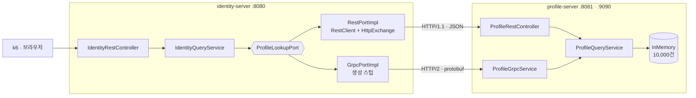

# grpc-vs-rest-lab

**gRPC 는 REST 보다 얼마나 빠른가.** 같은 도메인 코어에 전송 방식만 바꿔 끼우고 측정한 실험.

Spring Boot 3.5 · Java 21 · gRPC 1.73 · grpc-gateway · Envoy

## TL;DR

출발 가설은 "MSA 표준처럼 채택되니 많이 빠를 것이다" 였다. **측정이 그 가설을 반증했다.**

- **단건 조회에서 gRPC 가 더 느렸다.** 처리량이 REST 의 0.88배, 가상 스레드를 켠 REST 기준으로는 0.76배.
- **빨라지는 구간은 다건뿐이다.** 1,000건에서 1.56배, 요청당 CPU 40% 절감.
- **크기와 무관하게 남는 축이 실제 채택 근거였다.** TCP 커넥션 50개 대 1개, 전송량 2.5배 절감, 스키마 우선 계약.
- **단건 트래픽이면 gRPC 보다 가상 스레드가 먼저다.** 설정 한 줄로 처리량 1.15배, 최대 지연 3.4배 개선.
- **단 위 네 줄에는 "커넥션이 여유 있다"는 조건이 붙는다.** 커넥션 예산을 1개로 낮추면 같은 단건 조회에서 방향이 뒤집힌다. REST 는 약 9,000 req/s 에서 막히고 gRPC 는 12,625 req/s 를 넘겼다. 포화 구간의 지연 차이는 260배다.

| 상황 | 선택 | 근거 |
|---|---|---|
| 단건 조회 + 커넥션 여유 | **REST + 가상 스레드** | gRPC 가 0.76배로 더 느림 |
| 단건 조회 + **커넥션 희소** | **gRPC** | 커넥션 1개당 상한이 1.4배 이상, 포화 시 지연 260배 |
| 다건·대용량 | **gRPC** | 1.56배, CPU 40% 절감, 꼬리 지연 4.7배 |
| 커넥션·계약이 병목 | **gRPC** | 크기·스레드 모델과 무관하게 유지되는 축 |

**크기 축과 커넥션 축은 독립이다.** 응답이 작아도 커넥션이 희소하면 gRPC 가 이긴다. 두 축을 함께 보지 않으면 서로 반대되는 결론이 각각 "측정 결과"로 인용된다.

## 1. 무엇을 왜 확인하려 했나

MSA 에서 gRPC 는 사실상 표준처럼 채택된다. 그런데 근거로 인용되는 수치가 출처마다 다르다. "7~10배 빠르다"와 "작은 페이로드에서는 차이가 없다"가 함께 돌아다닌다.

세 가지를 직접 확인한다.

1. **얼마나 빠른가.** 페이로드 크기를 축으로 분리해 차이가 커지는 구간과 사라지는 구간을 찾는다.
2. **무엇이 빠르게 만드는가.** 프로토버프 직렬화인가, HTTP/2 멀티플렉싱인가. 구분하지 않으면 "gRPC 를 넣었는데 안 빨라졌다"의 원인을 짚을 수 없다.
3. **브라우저에서는 어떻게 보이는가.** 데브툴에서 프로토버프가 실제로 어떤 모습인지, grpc-gateway 를 끼우면 무엇이 달라지는지.

## 2. 리서치: 재기 전에 확인한 것

상세와 출처는 [docs/research.md](docs/research.md).

**gRPC 는 오래된 기술이고, 늦은 쪽은 Spring 이었다.** gRPC 는 2015년, grpc-gateway 도 비슷한 시기 기술이다. Kubernetes 는 2022년부터 gRPC 를 1급으로 다뤘다. Spring 만 커뮤니티 스타터가 그 자리를 채운 채 10년 가까이 지났고, Boot 4.1 로 밀린 것도 기술 장벽이 아니라 일정 문제였다. **Boot 3.5 는 공식 스타터가 없는 공백 구간**이라 이 랩은 grpc-java 를 직접 빈으로 등록한다.

**브라우저는 순수 gRPC 를 쓸 수 없다.** 호출 상태가 HTTP/2 trailer 에 실리는데 브라우저 `fetch` 가 trailer 를 읽지 못한다. 그래서 프런트엔드 대면 구간에는 항상 중간 계층이 필요하다.

**서비스 메시가 있어도 게이트웨이는 중복이 아니다.** grpc-gateway 는 프록시가 아니라 빌드 시 생성되는 코드라 배포 단위가 늘지 않는다. 반대로 메시에서 트랜스코딩하려면 `EnvoyFilter`(Istio 가 스스로 alpha·escape hatch 로 규정)와 descriptor 배달이 필요해 인프라 리소스가 늘어난다.

**리서치 단계에서 이미 가설이 흔들렸다.** gRPC 가 10년 된 기술인데도 채택 근거의 수치가 정리되어 있지 않다는 것은, 채택 이유가 속도만은 아닐 가능성을 뜻한다. 그래서 측정 축을 속도 하나로 두지 않기로 했다.

## 3. 그래서 무엇을 재기로 했나

축을 성격으로 나눠 잡았다. **크기에 따라 뒤집히는 축과 크기와 무관한 축을 갈라야 "조건부 이득"과 "항상 남는 이득"이 구분된다.**

| 축 | 왜 넣었나 |
|---|---|
| 처리량 · 지연 백분위 | 가장 많이 인용되는 값. 크기 의존을 확인 |
| 꼬리 지연 (max) | p95 가 좋아도 max 가 무너지는 경우를 잡는다 |
| **TCP 커넥션 수** | 지연·처리량에 안 나타나지만 대규모에서 먼저 병목이 된다 |
| **요청당 CPU** | 총 CPU 는 처리량 차이에 가려진다. 정규화가 필요 |
| 전송량 | 지연 이득이 없는 구간에도 대역폭 비용은 남는다 |

**REST 를 두 축으로 나눴다.** Java 21 가상 스레드를 켠 REST 가 오늘의 현실적 기준선이다. 플랫폼 스레드 REST 와만 비교하면 gRPC 이득이 부풀려지므로 `REST(플랫폼)` · `REST(가상)` · `gRPC` 세 축을 같은 빌드에서 잰다.

**의도적으로 재지 않은 것.** DB, 인증, 트랜잭션, 네트워크 지연. 빼는 것이 조건 통제다. 판단 근거는 [docs/domain.md](docs/domain.md#의도적으로-두지-않은-것).

## 4. 어떻게 쟀나

**재는 지점을 둘로 나눴다.** 프로토콜을 바로 때리는 **직접 측정**과 애플리케이션을 거치는 **경유 측정**이다. 직접 측정만 하면 부하 도구의 클라이언트 구현이 결과를 지배한다. 실제로 k6 의 동적 프로토버프 파싱 때문에 **gRPC 가 3.3배 느리다는 잘못된 결론**이 먼저 나왔다. 인용 값은 전부 경유 측정이다.

통제한 항목은 네 개다.

- **같은 도메인 코어.** REST 컨트롤러와 gRPC 서비스가 같은 유스케이스 하나를 호출한다. 프로토콜별 분기가 없다.
- **같은 JVM.** 두 전송을 한 프로세스의 다른 경로로 노출해 워밍업·GC 조건을 공유한다.
- **커넥션 재사용 대칭.** REST 쪽도 커넥션 풀을 명시해 gRPC 채널과 같은 조건으로 맞췄다.
- **DB 없음.** 인메모리 고정. 그래서 이 수치는 **프로토콜 오버헤드의 상한**이다.

설계와 통제 항목 전체는 [docs/benchmark-design.md](docs/benchmark-design.md), 도구·지표·함정 목록은 [bench/README.md](bench/README.md).

## 5. 결과

Java 21 · 50 VU · 30s · 워밍업 별도 실행 · 단일 호스트(RTT 거의 0). `상류` 는 호출 측이 자체 측정한 피호출 서비스 왕복 시간이다.

### 질문 1. 얼마나 빠른가

| 지표 | REST 플랫폼 | REST 가상 | gRPC |
|---|---|---|---|
| 처리량 1건 | 27,030 req/s | **31,136 req/s** | 23,698 req/s |
| 처리량 1,000건 | 8,153 req/s | 8,085 req/s | **12,685 req/s** |
| 상류 p95 1건 | 1.33 ms | **1.18 ms** | 2.48 ms |
| 상류 p95 1,000건 | 8.36 ms | 9.84 ms | **4.96 ms** |
| 상류 max 1건 | 119.4 ms | **35.5 ms** | 125.0 ms |
| 상류 max 1,000건 | 335.7 ms | 239.6 ms | **50.8 ms** |
| TCP 커넥션 | 50개 | 50개 | **1개** |
| 요청당 CPU 1건 | 66.8 µs | **60.0 µs** | 62.3 µs |
| 요청당 CPU 1,000건 | 360.0 µs | 337.9 µs | **203.5 µs** |
| 요청 처리 스레드 | exec 38~50개 | **캐리어 12개 고정** | executor 39~50개 |
| 전송량 (건당) | 기준 | 기준 | **약 2.5배 절감** |

| gRPC 배수 | vs REST 플랫폼 | vs REST 가상 |
|---|---|---|
| 처리량 1건 | 0.88× | **0.76×** |
| 처리량 1,000건 | 1.56× | 1.57× |

**기준선을 무엇으로 잡느냐가 단건 결론을 바꾼다.** 반대로 1,000건 이득은 기준선과 거의 무관하다. 스레드 모델을 개선해도 직렬화 비용은 줄지 않는다.

**가상 스레드는 단건에서만 이득이다.** 1건에서 처리량 1.15배, 최대 지연 3.4배 개선. 1,000건에서는 0.99배로 사라진다. 병목이 스레드 모델에서 직렬화 CPU 로 옮겨가면 손댈 곳이 없다. 확실한 이득은 처리량보다 **스레드 수**다. 동시성이 올라도 캐리어는 12개로 고정된다.

**꼬리 지연에는 하나의 승자가 없다.** 단건 max 는 가상 스레드가, 1,000건 max 는 gRPC 가 압도한다. 워크로드 크기를 먼저 정해야 판정이 가능하다.

### 질문 1-1. 위 결론은 커넥션이 여유 있을 때만 맞다

위 표의 커넥션 축(50개 대 1개)은 지연·처리량에 나타나지 않는다. 그런데 그것은 **풀 200 에 동시 요청 50** 이라 커넥션이 병목에서 한참 멀었기 때문이다. 커넥션이 마르면 어떻게 되는지는 재지 않은 상태였다.

부하를 올려 풀 한계에 닿게 하면 커넥션 고갈·CPU 포화·부하 도구 경합이 섞인다. 그래서 반대로 갔다. **부하를 올리지 않고 커넥션 예산을 양쪽 1개로 낮췄다.** REST/1.1 은 커넥션 1개에 요청 1건, HTTP/2 는 스트림으로 다중화하므로 **커넥션 1개가 나르는 양**을 직접 비교하는 형태가 된다. 실행 모델도 요청률 고정(열린 루프)으로 바꿨다. 닫힌 루프는 서버가 느려지면 부하도 줄어들어 과부하 구간을 못 본다.

| 요청률 목표 | 풀 | 전송 | 달성 처리량 | 상류 p50 | 상류 p95 | 버린 요청 |
|---|---|---|---|---|---|---|
| 6,400 | 1 | REST | 6,316 req/s | 72 µs | 1,795 µs | 1,259 |
| 6,400 | 1 | gRPC | 6,373 req/s | 79 µs | **245 µs** | 402 |
| 9,600 | 1 | REST | 8,812 req/s | **33,394 µs** | 61,987 µs | 11,631 |
| 9,600 | 1 | gRPC | 9,494 req/s | **129 µs** | 1,728 µs | 1,582 |
| 12,800 | 1 | REST | 9,043 req/s | 40,396 µs | 54,690 µs | **56,008** |
| 12,800 | 1 | gRPC | **12,625 req/s** | 156 µs | 3,806 µs | 2,615 |
| 12,800 | **4** | REST | 12,328 req/s | 118 µs | 20,862 µs | 6,747 |

**커넥션 1개당 REST 상한은 약 9,000 req/s 다.** 12,800 을 줘도 9,043 에서 멈추고 목표의 44% 를 버린다. gRPC 는 같은 커넥션 1개로 12,625 req/s 를 냈고 아직 커넥션에 막히지 않았다.

**꼬리 지연이 먼저 갈린다.** 6,400 구간에서 p50 은 양쪽이 거의 같은데(72 대 79 µs) p95 는 7.3배 벌어진다. **중앙값으로는 커넥션 포화를 판정할 수 없다.**

**REST 는 커넥션을 늘려 되찾지만 꼬리는 남는다.** 풀 4개로 12,328 req/s 까지 회복하고 p50 도 정상화되는데, p95 는 gRPC 커넥션 1개의 3.8 ms 대 20.9 ms 로 5.5배 차이다.

그래서 이 축의 결론은 우열이 아니라 **교환 조건**이다. 같은 처리량을 REST 는 커넥션 4개로, gRPC 는 1개로 낸다. 커넥션이 싼 환경에서는 풀을 키우면 되고, **팬인 구조에서 상류 인스턴스가 수백 개면 이 배수가 파일 디스크립터·소켓 메모리·로드밸런서 커넥션 한계에 그대로 곱해진다.**

풀 1개는 실무 설정이 아니므로 **옮겨 쓸 수 있는 값은 절대 처리량이 아니라 배수**다. 회차 조건과 한계는 [docs/benchmark-design.md](docs/benchmark-design.md#알려진-한계).

### 질문 2. 무엇이 빠르게 만드는가

세 요소가 서로 다른 것을 줄인다. **섞으면 "HTTP/2 때문에 페이로드가 작아진다" 같은 오해가 생긴다.**

| 기여 요소 | 줄이는 것 | 이 랩에서 |
|---|---|---|
| **프로토버프 직렬화** | **페이로드 크기** | 분리 확인 (아래) |
| HTTP/2 스트림 멀티플렉싱 | **커넥션 수** | 50개 대 1개로 확인 |
| HTTP/2 헤더 압축(HPACK) | 헤더 크기 | 측정하지 않음 |
| 위 요소들의 지연 기여분 | 지연 | **분리하지 못함** (REST h2c 축 필요) |

크기 이득이 직렬화에서 나온다는 것은 게이트웨이 대조로 확인된다. **전송 계층이 같고 직렬화만 다른 두 줄**을 보면 된다.

| 경로 | 전송 | 직렬화 | 100건 크기 |
|---|---|---|---|
| REST 직접 | HTTP/1.1 | JSON | 13,086 B |
| grpc-gateway | HTTP/1.1 | JSON | 13,286 B (1.02×) |
| grpc-web | HTTP/1.1 | 프로토버프 | **5,086 B (0.39×)** |

**HTTP/2 와 프로토버프로 통신하고도 마지막에 JSON 으로 직렬화하면 크기 이득이 0 이다.** grpc-gateway 가 그 경우다.

크기 차이의 원리는 **자기 기술적 포맷 대 스키마 의존 포맷**이다. JSON 은 필드명과 구조를 데이터마다 함께 싣고, 프로토버프는 스키마를 양쪽이 공유하므로 와이어에 **태그 번호와 값만** 남는다. 여기에 varint 가변 길이 인코딩과 proto3 기본값 생략이 더해진다. 기본값 생략은 `ProfileProtoMapperSpec` 이 코드로 고정해 둔 성질이다.

### 질문 3. 브라우저에서는 어떻게 보이는가

| 방식 | 데브툴에서 보이는 것 | 크기 |
|---|---|---|
| REST 직접 | JSON | 13,086 B |
| grpc-gateway | JSON (REST 와 구별 불가) | 13,286 B |
| grpc-web 바이너리 | 프로토버프 바이너리 | 5,086 B |
| grpc-web base64 | base64 문자열 | 6,784 B |

**grpc-gateway 를 쓰면 브라우저 쪽은 그냥 REST 다.** 프로토버프가 보이지 않고 크기 이득도 없다. protojson 이 int64 를 문자열로 인코딩하기 때문이다(JS number 정밀도 한계). **grpc-gateway 의 값은 성능이 아니라 호환성이다.**

hex 분석과 프레임 구조는 [docs/browser-observation.md](docs/browser-observation.md).

## 6. 결론

**성능은 채택 근거 중 하나이고 조건부다.** "gRPC 를 넣으면 빨라진다"는 문장은 페이로드 크기를 빼놓고 성립하지 않는다. 근거를 강한 순서로 놓으면 이렇다.

1. **커넥션 50배 절감 (크기 무관).** 인스턴스 수백 개가 한 서비스를 부르는 구조에서 파일 디스크립터·소켓 메모리·TLS 세션 수가 자릿수 단위로 달라진다. 가상 스레드로도 바뀌지 않는다. 그리고 이것은 자원 절감으로만 끝나지 않는다. **커넥션이 희소해지면 지연으로 전환된다**(질문 1-1). 응답 크기와 무관하게 gRPC 가 이기는 구간이 여기서 생긴다.
2. **스키마 우선 계약.** 응답 필드가 바뀌면 `.proto` 재생성 시 컴파일이 깨져 드러난다. 소비자 언어가 여러 개면 언어별 클라이언트를 손으로 관리하지 않아도 된다.
3. **대역폭 2.5배 절감 (크기 무관).**
4. **다건 구간의 처리량 1.56배, 요청당 CPU 40% 절감.** 목록 조회·배치 동기화·팬아웃 집계에 해당한다.

**단건 트래픽이면 gRPC 보다 가상 스레드가 먼저다.** 같은 코드에 설정 한 줄, 계약 불변, 배포 단위 불변으로 더 큰 이득을 얻는다. gRPC 전환은 훨씬 큰 작업이면서 그 구간에서는 손해다. **다만 커넥션이 희소한 단건 트래픽은 예외다.** 가상 스레드는 스레드 수를 줄이지만 커넥션 수는 줄이지 않으므로, 병목이 커넥션이면 손댈 곳이 없다.

**프런트엔드 대면 구간에서는 이득을 그대로 가져올 수 없다.** 브라우저가 trailer 를 읽지 못하므로 항상 중간 계층이 끼고, 그 계층이 이득의 일부 또는 전부를 소비한다. grpc-gateway 는 전부 반납하고, grpc-web 은 프록시와 클라이언트 코드 생성을 요구한다. **gRPC 가 내부 통신에서 먼저 자리 잡은 것은 이 구조적 비대칭 때문이다.**

**그리고 gRPC 는 결합을 바꾸지 않는다.** 동기 RPC 이므로 호출하는 쪽이 상대를 알아야 하고, 순환 의존을 끊지 못한다. 순환을 끊는 힘은 프로토버프가 아니라 "발행자가 소비자를 모른다"는 이벤트의 성질에서 나온다. 다만 계약이 `.proto` 에 있으면 계약 모듈이 도메인 타입을 참조할 방법이 없어져, 모듈 빌드 의존 순환에는 구조적 답이 된다. 상세와 실무 사례는 [docs/protocol-vs-coupling.md](docs/protocol-vs-coupling.md).

## 7. 회고: 가설이 틀렸다

출발 질문은 **"얼마나 빠르길래 표준처럼 채택되는가"** 였다. 속도를 재면 채택 근거가 나올 것이라는 전제가 깔려 있었다. 그 전제가 두 번 깨졌다.

**리서치에서 한 번.** 10년 된 기술인데 채택 근거의 수치가 정리되어 있지 않았다. 속도가 주된 이유였다면 그럴 리가 없다.

**측정에서 한 번 더.** 단건에서는 오히려 느렸고, 기준선을 현실적으로 잡을수록 더 느려졌다. 반면 커넥션과 계약은 조건과 무관하게 남았다. **질문을 "얼마나 빠른가"에서 "무엇이 조건과 무관하게 남는가"로 바꿔야 했다.**

측정 과정에서 얻은 것 네 개다. 나머지는 [bench/README.md](bench/README.md#함정-목록) 함정 목록에 있다.

- **기준선은 정지해 있지 않다.** 같은 gRPC 가 플랫폼 스레드 대비 0.88배, 가상 스레드 대비 0.76배다. "무엇 대비" 를 밝히지 않은 배수는 의미가 없다.
- **같은 개선이 조건에 따라 사라진다.** 가상 스레드는 단건에서 1.15배, 1,000건에서 0.99배다. 병목이 옮겨가면 손댈 곳이 없어진다.
- **부하 도구가 결과를 지배할 수 있다.** k6 의 동적 프로토버프 파싱을 통제하지 않으면 3.3배 왜곡이 생긴다.
- **스레드 풀 오염이 수치를 12% 왜곡했다.** 앞선 부하가 남은 JVM 에서 잰 gRPC 1,000건은 11,317 req/s, 새 JVM 에서는 12,685 req/s 였다.

**남은 한계.** 단일 호스트라 RTT 가 거의 0 이고(gRPC 에 불리한 조건), DB 가 없어 프로토콜 오버헤드의 상한을 본 셈이다. 동시성 모델은 부분적으로만 통제했고, 지연에서 HTTP/2 기여분과 프로토버프 기여분은 분리하지 못했다. 전체 목록은 [docs/benchmark-design.md](docs/benchmark-design.md#알려진-한계).

## 구조

두 서비스를 띄워 서비스 간 호출을 재현한다. `identity` 가 호출 측, `profile` 이 피호출 측이다.



핵심은 `ProfileLookupPort` 하나에 구현이 두 개라는 점이다. 전송 방식을 바꾸는 작업이 **구현체를 하나 더 추가하는 일**로 끝나는지가 이 구조의 실익을 판정하는 기준이다.

### 레포 구성

한 레포에 Java 와 Go 가 함께 있다. 선택이 아니라 강제다. **grpc-gateway 는 Go 전용 protoc 플러그인이고 Java 구현체가 없다.**

```
proto/                      계약 SSOT (.proto 1개)
profile/{api,core,adapter}  Java · 피호출 서비스
identity/{api,core,adapter} Java · 호출 서비스
{profile,identity}-server/  Java · 실행 모듈
gateway/                    Go · 독립 go.mod. grpc-gateway + grpc-web
envoy/envoy.yaml            설정 1개. 바이너리는 Docker 이미지
web/ · bench/ · docs/       관측 페이지 · 벤치마크 · 문서
```

Gradle 멀티모듈과 Go 모듈은 서로를 모른다. 연결점은 `.proto` 파일 하나이고 양쪽이 같은 파일에서 각자 코드를 생성한다. **IDL(Interface Definition Language) 계약이 언어를 넘는다는 주장의 실물이 이 지점이다.**

도메인마다 `api · core · adapter` 세 모듈로 나누고 의존 방향은 항상 안쪽을 향한다. `identity` 는 `profile` 에 컴파일 의존하지 않는다. 도메인 모델은 [docs/domain.md](docs/domain.md), 모듈 구성과 설계 판단은 [docs/architecture.md](docs/architecture.md).

## 실행

```bash
./run-all.sh          # 서버 2대 + 게이트웨이 + Envoy + 관측 페이지
./run-all.sh --build  # 빌드부터
./stop-all.sh         # 종료

./gradlew test        # 테스트 (서버 기동 없이 돈다)
```

```bash
# 서비스 간 호출. 전송 방식만 다르고 응답 구조는 같다
curl "http://localhost:8080/api/v1/me/rest?size=100"
curl "http://localhost:8080/api/v1/me/grpc?size=100"

# REST 직접 vs grpc-gateway. 같은 경로, 같은 데이터
curl "http://localhost:8081/v1/profiles?size=100"
curl "http://localhost:8090/v1/profiles?size=100"
```

**브라우저 관측**은 `http://localhost:8000` 에서 데브툴 Network 탭을 열고 "전부 호출" 을 누른다. **벤치마크**는 [bench/README.md](bench/README.md) 의 실행 절차(가상 스레드 회차 포함)를 따른다. 프로세스를 하나씩 띄우려면 `run-all.sh` 안의 명령을 그대로 쓰면 되고, grpc-web 프레임을 직접 만들어 보는 예시는 [docs/browser-observation.md](docs/browser-observation.md#3-프로토버프는-이렇게-보인다) 에 있다.

## 진행 상태

- [x] 도메인 2개 · 서버 2대 · REST/gRPC 인바운드 어댑터
- [x] RestClient 선언형 클라이언트 · gRPC 스텁 아웃바운드 어댑터
- [x] k6 벤치마크 2층 측정 · 자원 지표 수집
- [x] grpc-gateway (Go) · grpc-web 프록시 (Go 최소 구현 + Envoy) · 브라우저 관측 페이지
- [x] 도메인·유스케이스·proto 경계 테스트 (Spock 17개)
- [x] Java 21 가상 스레드 축 추가 (`REST(플랫폼)` · `REST(가상)` · `gRPC`)
- [ ] 3축 크기별 곡선으로 교차점 재측정
- [ ] 네트워크 지연 주입 후 교차점 이동 확인
- [ ] 게이트웨이 경유 시 지연 오버헤드 측정
- [ ] REST h2c 축 추가로 지연의 HTTP/2 기여분 분리
- [ ] k3s 배포 매니페스트

## 문서

| 문서 | 내용 |
|------|------|
| [docs/research.md](docs/research.md) | gRPC 연혁, Spring 지원 시점, 브라우저 제약, 스타터를 쓰지 않은 근거, 서비스 메시와 게이트웨이의 계층 구분 |
| [docs/domain.md](docs/domain.md) | 도메인 모델·파생 규칙·포트, 의도적으로 두지 않은 것 |
| [docs/architecture.md](docs/architecture.md) | 헥사고날 모듈 구성, 설계 판단, 테스트가 확인하는 것 |
| [docs/protocol-vs-coupling.md](docs/protocol-vs-coupling.md) | 프로토콜 축과 결합 축의 분리, 빌드 의존 순환과 스키마 모듈 |
| [bench/README.md](bench/README.md) | **도구·지표 세트·실행 절차·결과 해석·함정 목록** |
| [docs/benchmark-design.md](docs/benchmark-design.md) | 측정 설계, 통제 항목, 측정값 전체, 알려진 한계 |
| [docs/browser-observation.md](docs/browser-observation.md) | 데브툴 관측 결과, hex 분석, 프레임 구조 |
