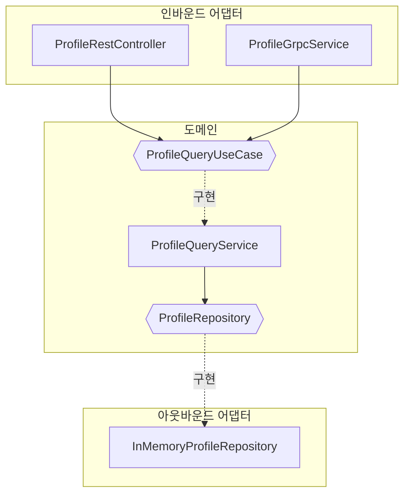
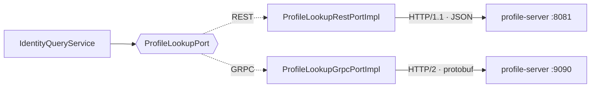

# 아키텍처

## 왜 헥사고날인가

이 랩의 목적은 REST 와 gRPC 를 같은 조건에서 비교하는 것이다. 그런데 "같은 조건"을 만들기가 쉽지 않다. 프로토콜별로 서버를 따로 만들면 도메인 로직이 두 벌이 되고, 그러면 측정된 차이가 프로토콜 차이인지 구현 차이인지 구분할 수 없다.

포트와 어댑터로 나누면 이 문제가 구조적으로 해결된다. **도메인 로직을 한 벌만 두고, 프로토콜을 어댑터로 갈아 끼운다.**



두 인바운드 어댑터가 공유하는 지점은 `ProfileQueryUseCase` 하나다. 어댑터가 하는 일은 두 가지로 한정된다.

1. 프로토콜 메시지와 전송 객체를 옮기는 것
2. 도메인 예외를 프로토콜의 오류 표현으로 번역하는 것

2번이 프로토콜별로 다르다는 점이 흥미롭다. REST 어댑터는 `ProfileNotFoundException` 을 HTTP 404 로 번역하고, gRPC 어댑터는 `Status.NOT_FOUND` 로 번역한다. 도메인은 둘 다 모른다.

## 모듈 구성

도메인마다 세 모듈로 나눈다.

| 모듈 | 의존 방향 | 담은 것 |
|------|----------|--------|
| `{domain}/api` | 아무것도 의존하지 않음 | UseCase 인터페이스, 전송 객체(record), enum, 예외 |
| `{domain}/core` | `api` | 도메인 객체, UseCase 구현, 아웃바운드 포트 |
| `{domain}/adapter` | `api` + `core` | REST 컨트롤러, gRPC 서비스, 저장소 구현, 외부 클라이언트 |
| `proto` | 없음 | `.proto` 파일과 생성 스텁 |
| `{domain}-server` | 위 세 개 | 부트 진입점, 설정 파일 |

의존 방향이 항상 안쪽(`api`)을 향한다. `core` 는 `adapter` 를 모르므로, 저장소를 인메모리에서 JPA 로 바꿔도 `core` 는 컴파일 대상이 아니다.

### 서비스 경계

`identity` 는 `profile` 모듈에 **컴파일 의존하지 않는다.** 두 서비스가 지금은 한 레포에 있지만 별개 프로세스로 뜨고, 나중에 별도 레포·별도 클러스터로 떼어도 코드가 바뀌지 않아야 한다.

경계를 넘는 데이터는 포트가 정의한 타입으로만 들어온다.

```java
public interface ProfileLookupPort {
  Transport transport();
  LookupResult list(int size);

  record LookupResult(int count, String sampleNickname) {}
}
```

`identity/adapter` 는 `proto` 모듈(gRPC 스텁)과 자체 선언한 HTTP 응답 record 를 쓴다. `profile` 의 `ProfileData` 를 재사용하면 편하지만, 그러면 두 서비스가 같은 클래스에 묶여 독립 배포 의미가 사라진다. 실제 MSA 에서는 애초에 다른 레포라 참조가 불가능하다.

## 전송 방식 선택

`identity` 는 아웃바운드 포트 하나에 구현이 두 개다.



서비스는 두 구현을 리스트로 주입받아 각 구현이 선언한 `transport()` 값으로 맵을 만든다.

```java
public IdentityQueryService(List<ProfileLookupPort> profileLookupPorts) {
  profileLookupPorts.forEach(port -> ports.put(port.transport(), port));
}
```

`if (transport == GRPC)` 같은 조건문이 없다. 전송 방식을 추가할 때 이 클래스는 수정되지 않고, 구현체 하나와 enum 값 하나만 늘어난다. **프로토콜 교체 비용이 이 정도인지가 헥사고날 구조의 실익을 판정하는 기준이다.**

## 두 클라이언트의 대비

비교 대상인 두 아웃바운드 어댑터가 구조적으로 어떻게 다른지가 이 랩에서 가장 눈여겨볼 지점이다.

| | REST | gRPC |
|---|------|------|
| 계약 정의 | 인터페이스에 `@HttpExchange` 선언 | `.proto` 파일 |
| 스텁 생성 시점 | 런타임 (`HttpServiceProxyFactory` 프록시) | 컴파일 타임 (protoc 플러그인) |
| 계약 위반 발견 시점 | 역직렬화 시점 (런타임) | 재생성 후 컴파일 시점 |
| 커넥션 관리 | 커넥션 풀 (`PoolingHttpClientConnectionManager`) | 채널 (HTTP/2 멀티플렉싱) |
| 호출 코드 | `profileHttpClient.list(size)` | `profileStub.listProfiles(request)` |

호출하는 코드 모양은 거의 같다. 차이는 **계약을 검증하는 시점**이다. 서버가 응답 필드를 바꿨을 때 gRPC 쪽은 `.proto` 를 갱신해 재생성하면 컴파일이 깨져서 알게 되고, REST 쪽은 배포 후 역직렬화 시점까지 조용하다. 스키마 우선 방식의 실질적 이득이 성능보다 이쪽이라는 주장이 여기서 나온다.

## 테스트가 확인하는 것

헥사고날의 실익 주장은 검증 가능해야 한다. 이 랩의 테스트는 그 주장 자체를 대상으로 삼는다 (Spock, 17개).

| 테스트 | 확인하는 주장 |
|--------|-------------|
| `ProfileSpec` | 인증 판정이 도메인에 있으므로 두 프로토콜이 같은 규칙을 거친다 (경계 70점) |
| `ProfileQueryServiceSpec` | 유스케이스를 스프링 컨텍스트·서버 기동·네트워크 없이 검증할 수 있다 |
| `IdentityQueryServiceSpec` | 전송 선택이 조건문이 아니라 구현 선택이므로 주입 순서에 무관하다 |
| `ProfileProtoMapperSpec` | 도메인·proto 두 벌 매핑의 필드 누락, 그리고 proto3 기본값 생략 |

`ProfileQueryServiceSpec` 이 저장소 포트만 대역으로 바꿔 통과한다는 사실이 "도메인 로직 한 벌" 주장의 근거다. 어댑터로 로직이 새어 나가면 이 테스트로는 잡히지 않으므로, 어댑터 테스트를 늘리는 것보다 **어댑터를 얇게 유지하는 쪽**이 검증 비용을 줄인다.

`ProfileProtoMapperSpec` 의 두 번째 케이스는 리드미 크기 비교의 근거를 코드로 고정한 것이다. `setTrustScore(0)` 을 명시해도 직렬화 크기가 설정하지 않은 것과 같다는 것이 proto3 의 기본값 생략이고, JSON 은 같은 상황에서 키를 남긴다.

**측정 코드는 테스트 대상이 아니다.** 벤치마크 스크립트와 게이트웨이 Go 코드에는 테스트가 없다. 측정 신뢰성은 조건 통제와 재현 절차로 확보하며, 그 항목은 [benchmark-design.md](benchmark-design.md) 에 있다.

## 조건 통제를 위한 설계 판단

측정 정확도를 위해 의도적으로 선택한 항목들.

| 판단 | 이유 |
|------|------|
| 전송 방식을 경로로 분리 (`/me/rest`, `/me/grpc`) | 한 JVM 에서 번갈아 호출해 워밍업·GC 조건을 공유 |
| REST 커넥션 풀 명시 (`maxConnections=200`) | gRPC 채널이 커넥션을 재사용하므로 REST 도 같은 조건으로 맞춤 |
| 양쪽 모두 평문 (TLS 없음) | TLS 핸드셰이크 비용이 프로토콜 차이에 섞이는 것을 방지 |
| DB 없이 인메모리 | DB 왕복이 프로토콜 차이를 덮는 것을 방지 |
| 응답에 원본 대신 요약만 담음 | 클라이언트 to identity 구간 직렬화가 측정 구간을 덮는 것을 방지 |
| blocking 스텁 사용 | 비교 대상 RestClient 가 동기이므로 호출 모델을 일치 |
| 고정 시드 데이터셋 | 실행마다 같은 페이로드가 나오게 함 |

상세는 [benchmark-design.md](benchmark-design.md).
