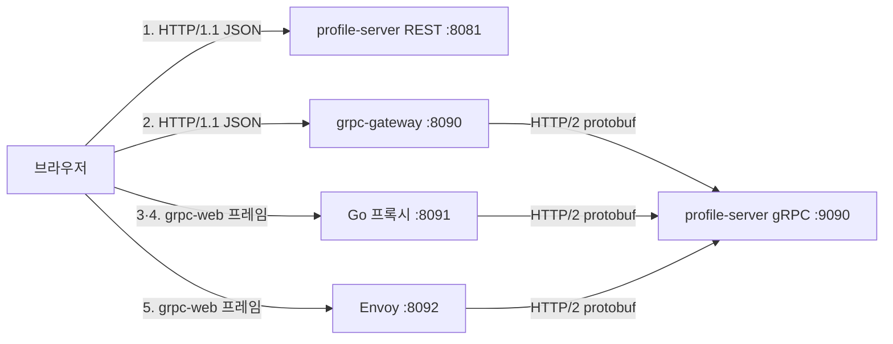

# 브라우저 관측

"gRPC 를 쓰면 개발자도구에서 프로토버프가 어떻게 보이는가."

이 질문에는 함정이 있다. **grpc-gateway 를 쓰는 구성에서는 프로토버프가 보이지 않는다.** 브라우저는 JSON 을 주고받고 변환은 게이트웨이 안에서 일어난다. 그래서 다섯 경로를 나란히 띄워 무엇이 실제로 다른지 확인했다.

관측 페이지는 `web/index.html`. `python3 -m http.server 8000` 으로 서빙한 뒤 데브툴 Network 탭을 열고 "전부 호출"을 누르면 다섯 줄이 쌓인다.

## 구성



3·4 번의 Go 프록시는 Envoy 의 `grpc_web` 필터가 하는 일을 최소 구현으로 드러낸 것이다(`gateway/grpcweb.go`). 실무에서는 5 번이 표준이고, 3 번은 프레임 구조를 코드로 보이기 위한 것이다.

## 전송 크기 (동일 데이터 100건)

| # | 경로 | 응답 바이트 | 건당 | JSON 대비 |
|---|------|-----------|------|-----------|
| 1 | REST 직접 | 13,086 | 130.9 B | 1.00× |
| 2 | grpc-gateway | 13,286 | 132.9 B | **1.02×** |
| 3 | grpc-web 바이너리 | 5,086 | 50.9 B | **0.39×** |
| 4 | grpc-web base64 | 6,784 | 67.8 B | 0.52× |
| 5 | grpc-web via Envoy | 5,085 | 50.9 B | 0.39× |

## 관측 결과

### 1. grpc-gateway 를 쓰면 브라우저 쪽은 그냥 REST 다

2 번 요청은 서버가 gRPC·프로토버프로 처리한 결과지만 Response 탭에는 JSON 이 보인다. Content-Type 도 `application/json` 이다. **데브툴만 봐서는 백엔드가 gRPC 인지 알 수 없다.**

단서가 하나 있다. 응답 헤더에 gRPC 메타데이터가 그대로 노출된다.

```
Grpc-Metadata-Content-Type: application/grpc
Grpc-Metadata-Grpc-Accept-Encoding: gzip
```

게이트웨이가 상류 gRPC 응답의 메타데이터를 `Grpc-Metadata-` 접두로 붙여 전달하기 때문이다. 이 헤더가 게이트웨이 경유를 구별하는 실질적 지표다.

Transfer-Encoding 도 다르다. REST 서버(톰캣)는 `chunked` 로 보내고 게이트웨이는 `Content-Length` 를 명시한다.

### 2. grpc-gateway 는 프로토버프의 크기 이득을 반납한다

게이트웨이 응답이 REST 직접 응답보다 **오히려 200 바이트 크다.** 원인은 int64 필드다.

```
REST 직접   : "joinedAt": 1700000000000
게이트웨이  : "joinedAt": "1700000000000"
```

protojson 이 64비트 정수를 문자열로 인코딩하는 것은 표준 동작이다. JavaScript 의 `number` 가 배정밀도 부동소수점이라 2^53 을 넘는 정수를 정확히 표현하지 못하기 때문이다. 따옴표 두 개가 건당 2 바이트씩 붙어 100 건에서 200 바이트가 된다.

여기서 얻는 결론이 중요하다. **브라우저 to 게이트웨이 구간은 JSON 이므로, 프로토버프의 2.5배 크기 이득이 그 구간에서 사라진다.** grpc-gateway 의 값은 성능이 아니라 호환성이다. 기존 REST 클라이언트를 그대로 두고 서버만 gRPC 로 옮길 수 있게 해준다.

### 3. 프로토버프는 이렇게 보인다

3 번 요청의 Response 탭에 바이너리가 나타난다. 앞부분을 hex 로 읽으면 구조가 그대로 드러난다.

```
0000 0000 96 0a 2e 0a 0a 75 73 65 72 2d 30 30 30 30 30 ...
│    └───┬──┘ │  │  │  │  └── "user-00000"
│        │    │  │  │  └───── 길이 10
│        │    │  │  └──────── 필드 1 (user_id), wire type 2
│        │    │  └─────────── 길이 46 (Profile 메시지)
│        │    └────────────── 필드 1 (profiles), wire type 2
│        └─────────────────── 프레임 길이 150 (0x96)
└──────────────────────────── 프레임 flag 0x00 (데이터)
```

필드 이름이 와이어에 없다. `0a` 같은 태그 바이트가 필드 번호와 타입을 지시하고, 이름은 `.proto` 를 아는 양쪽만 안다. **JSON 이 매 건마다 `"userId"`, `"nickname"` 같은 키 문자열을 반복 전송하는 것과의 차이가 크기 차이의 주된 원인이다.**

응답 끝에는 trailer 프레임이 붙는다.

```
80 00 00 00 10 grpc-status: 0
│  └────┬───┘  └── trailer 본문
│       └───────── 길이 16
└───────────────── flag 0x80 (trailer)
```

### 4. base64 모드는 이득의 1/3을 반납한다

4 번은 같은 바이트를 base64 로 감싼 것이다. 5,086 → 6,784 바이트로 33% 늘어난다. base64 가 3 바이트를 4 문자로 바꾸므로 정확히 4/3 배다.

읽기는 훨씬 쉽다. 데브툴에 문자열로 나타나므로 복사해 디코딩할 수 있다.

```
AAAAAJYKLgoKdXNlci0wMDAwMBIO7IKs7Jqp7J6QMDAwMDAaCeyXreyCvOuPmTCA0JX/vDEKMAoK...
```

원래 grpc-web 이 base64 모드를 둔 이유는 XHR 로 바이너리를 다루기 어려웠던 시절의 제약이었다. 지금은 `fetch` 로 `ArrayBuffer` 를 받을 수 있어 바이너리 모드를 쓰는 것이 맞다.

### 5. 최소 구현과 Envoy 가 같은 바이트를 낸다

3 번(직접 구현한 Go 프록시)과 5 번(Envoy)의 응답이 1 바이트 차이다. trailer 본문의 공백뿐이다.

```
직접 구현 : "grpc-status: 0\r\n"   (16 바이트)
Envoy     : "grpc-status:0\r\n"    (15 바이트)
```

프레임 구조가 단순해서 최소 구현으로도 동일한 결과를 낼 수 있다는 뜻이고, 반대로 말하면 grpc-web 프록시가 하는 일이 프레임 변환과 trailer 이동뿐이라는 확인이다.

### 6. grpc-web 에만 프리플라이트가 붙는다

데브툴 목록을 보면 요청이 다섯 개가 아니라 여섯 개 이상이다. `ListProfiles` 중 하나가 `OPTIONS` 다.

| 요청 | 프리플라이트 | 이유 |
|------|------------|------|
| 1·2 번 (GET, JSON) | 없음 | 단순 요청(simple request) 조건을 만족 |
| 3·4·5 번 (POST, grpc-web) | **있음** | Content-Type 과 커스텀 헤더가 조건 위반 |

단순 요청으로 인정되는 Content-Type 은 `text/plain`, `multipart/form-data`, `application/x-www-form-urlencoded` 셋뿐이다. grpc-web 이 쓰는 `application/grpc-web+proto` 는 목록 밖이고, 여기에 `X-Grpc-Web` 커스텀 헤더까지 붙는다. 둘 중 하나만 있어도 브라우저가 `OPTIONS` 를 먼저 보낸다.

**즉 크로스 오리진 구성에서 grpc-web 을 쓰면 프로토버프 크기 이득과 무관한 OPTIONS 왕복 비용이 붙는다.** 완화 수단은 두 가지다.

- `Access-Control-Max-Age` 로 프리플라이트 캐시 기간을 늘린다. 지정하지 않으면 브라우저 기본값(크롬 5초)이라 왕복이 자주 반복된다. Envoy 의 grpc_web 예제 설정과 이 랩의 Go 프록시 모두 `1728000`(20일)을 쓴다.
- 프록시를 같은 오리진에 두면 애초에 발생하지 않는다. 실제 배포에서는 게이트웨이나 프록시가 같은 도메인 경로 아래 놓이는 구성이 흔하므로, 이 비용은 로컬 랩 구성에서 두드러지는 편이다.

이 항목은 관측 페이지를 브라우저에서 처음 돌려 보고 나서야 드러났다. curl 은 CORS 를 적용하지 않기 때문에 그 전 검증에서는 나타나지 않았다.

## 왜 브라우저가 순수 gRPC 를 못 쓰는가

gRPC 는 호출 상태(`grpc-status`, `grpc-message`)를 응답 본문이 아니라 **HTTP/2 trailer** 에 담는다. 브라우저의 `fetch`·`XMLHttpRequest` 는 trailer 를 읽는 API 를 제공하지 않고 HTTP/2 프레임을 직접 다룰 수도 없다.

grpc-web 은 그 상태를 **본문 끝의 trailer 프레임(`0x80`)으로 옮겨** 해결한다. 위 3 번 관측에서 확인한 그 프레임이다.

이 사실은 서버 코드에도 드러난다. `ProfileGrpcService` 는 도메인 예외를 `Status.NOT_FOUND` 로 번역하는데 그 값이 trailer 로 나가고, REST 어댑터는 같은 예외를 HTTP 404 로 번역해 상태 라인에 싣는다. 같은 도메인 예외가 프로토콜에 따라 다른 자리에 실린다.

## 정리

| 목적 | 선택 |
|------|------|
| 기존 REST 클라이언트 유지하며 서버만 gRPC 로 | grpc-gateway. 단 크기 이득은 없다 |
| 브라우저에서 프로토버프 이득까지 얻기 | grpc-web (Envoy `grpc_web` 필터) |
| 서비스 간 내부 통신 | 순수 gRPC. 프록시 불필요 |

브라우저가 끼는 순간 선택지가 갈리고, 어느 쪽을 골라도 서비스 간 통신에서 얻던 이득을 그대로 가져오지는 못한다. 이것이 **gRPC 가 프런트엔드 대면 API 보다 서비스 간 통신에서 먼저 채택되는 구조적 이유**다.
