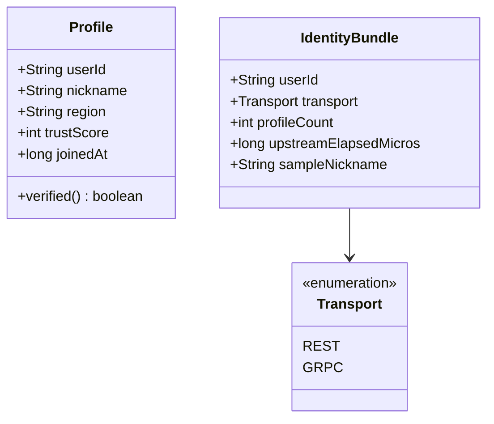
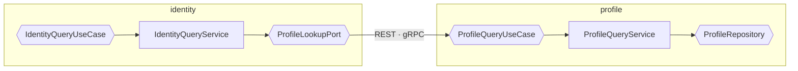

# 도메인 설계

비교 실험이지만 도메인을 임의로 두면 측정 조건이 흔들린다. 무엇을 도메인에 두고 무엇을 두지 않았는지를 남긴다.

## 도메인을 두 개로 나눈 이유

서비스 간 통신을 비교하려면 **호출하는 쪽과 호출받는 쪽이 별개 프로세스**여야 한다. 한 프로세스 안의 메서드 호출로는 프로토콜 차이가 나타나지 않는다.

| 도메인 | 역할 | 서버 |
|--------|------|------|
| `profile` | 조회 대상 데이터를 가진 쪽. REST·gRPC 인바운드 어댑터를 함께 노출 | `:8081` REST, `:9090` gRPC |
| `identity` | 상류를 호출하는 쪽. 같은 유스케이스를 두 전송으로 수행 | `:8080` |

두 도메인은 서로의 모듈에 컴파일 의존하지 않는다. 경계를 넘는 데이터는 포트가 선언한 타입으로만 들어온다.

## 모델



`Profile` 이 유일한 애그리거트다. 식별자는 `userId` 이고 다른 애그리거트를 참조하지 않는다.

`IdentityBundle` 은 애그리거트가 아니라 **호출 결과 요약**이다. 상태를 갖지 않고 매 호출마다 새로 만들어진다.

## 파생 규칙

`verified` 는 저장값이 아니다. `trustScore >= 70` 에서 파생된다.

```java
public boolean verified() {
  return trustScore >= VERIFIED_THRESHOLD;
}
```

**규칙을 도메인에 둔 것이 측정 조건이기도 하다.** 어댑터에서 각각 계산하면 REST 응답과 gRPC 응답이 다른 판정을 거칠 수 있고, 그러면 측정된 차이에 로직 차이가 섞인다. 규칙이 한 곳에 있으므로 두 프로토콜은 같은 판정을 통과한 결과만 직렬화한다.

## 언어 대응

`.proto` 는 `snake_case`, Java 는 `camelCase` 를 쓴다. 이름이 바뀌는 지점이 있으므로 대응을 고정한다.

| proto 필드 | 도메인 | 의미 |
|-----------|--------|------|
| `user_id` | `userId` | 사용자 식별자 |
| `trust_score` | `trustScore` | 신뢰 점수. 인증 판정의 입력 |
| `verified` | `verified()` | 인증 배지. **파생값이므로 도메인에는 필드가 없다** |
| `joined_at` | `joinedAt` | 가입 시각. epoch milli |

`verified` 만 성질이 다르다. proto 메시지에는 필드로 존재하지만 도메인에는 없다. 와이어로 나갈 때 파생 결과가 값으로 굳는 지점이다.

## 포트



| 포트 | 방향 | 구현 |
|------|------|------|
| `ProfileQueryUseCase` | 인바운드 | `ProfileQueryService` 1개. REST 컨트롤러와 gRPC 서비스가 공유 |
| `ProfileRepository` | 아웃바운드 | `InMemoryProfileRepository` 1개 |
| `IdentityQueryUseCase` | 인바운드 | `IdentityQueryService` 1개 |
| `ProfileLookupPort` | 아웃바운드 | **2개.** `ProfileLookupRestPortImpl`, `ProfileLookupGrpcPortImpl` |

아웃바운드 포트 하나에 구현이 두 개라는 점이 이 랩의 비교 기준이다. 전송을 추가할 때 유스케이스는 수정되지 않는다.

## 의도적으로 두지 않은 것

작은 실험에 구조를 더 넣으면 목적이 흐려진다. 다음은 넣지 않았다.

| 넣지 않은 것 | 이유 |
|-------------|------|
| 프로필 생성·수정 유스케이스 | 조회만으로 페이로드 크기 차이를 만들 수 있다. 쓰기는 측정 대상이 아니다 |
| 트랜잭션·동시성 제어 | 상태를 바꾸지 않으므로 필요 없다. 넣으면 락 대기가 측정값에 섞인다 |
| DB·JPA | 왕복 지연이 프로토콜 차이를 덮는다. 인메모리 고정 데이터셋 10,000건 |
| 도메인 이벤트 | 결합 방향은 이 랩의 측정 대상이 아니다. 논의는 [protocol-vs-coupling.md](protocol-vs-coupling.md) |
| 인증·인가 | 전송 계층 비교에 TLS·토큰 검증 비용이 섞이는 것을 막기 위해 평문으로 고정 |

마지막 세 줄은 **측정 조건이기도 하다.** 빼는 것이 조건 통제다.
